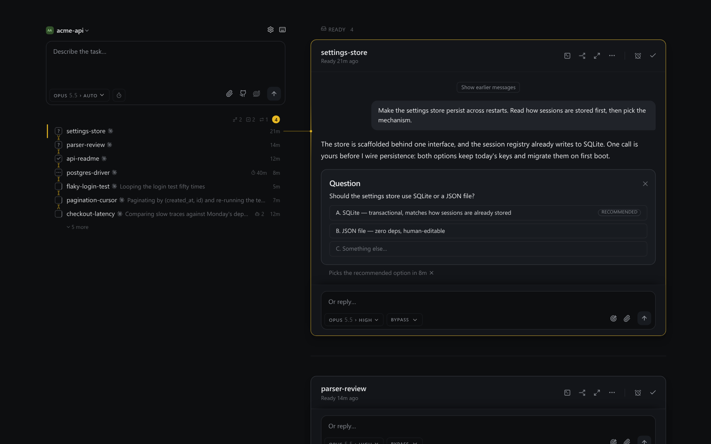
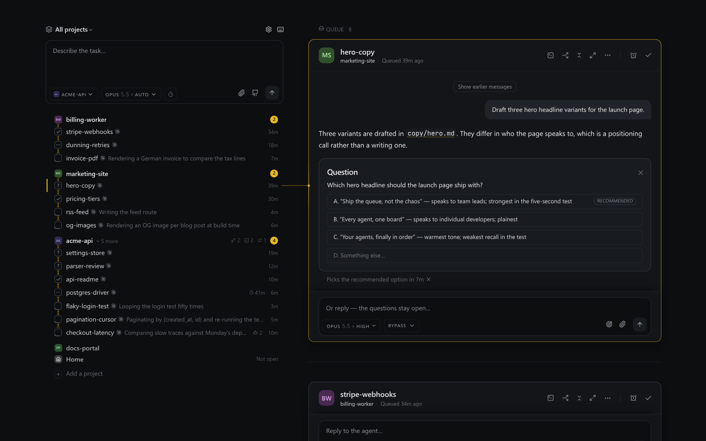
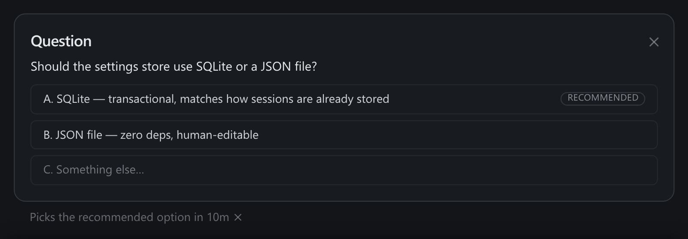
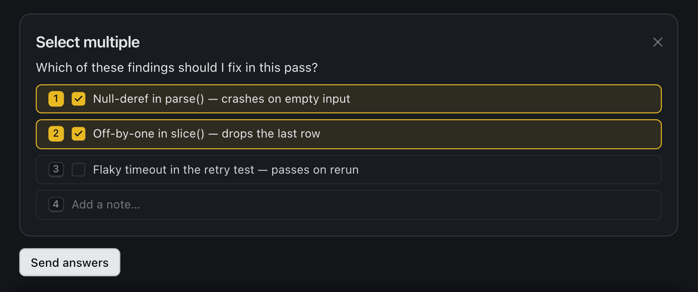
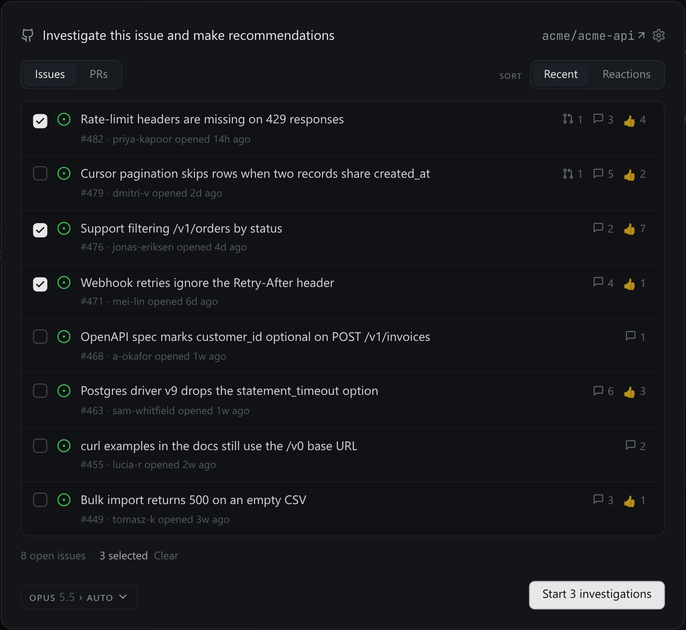
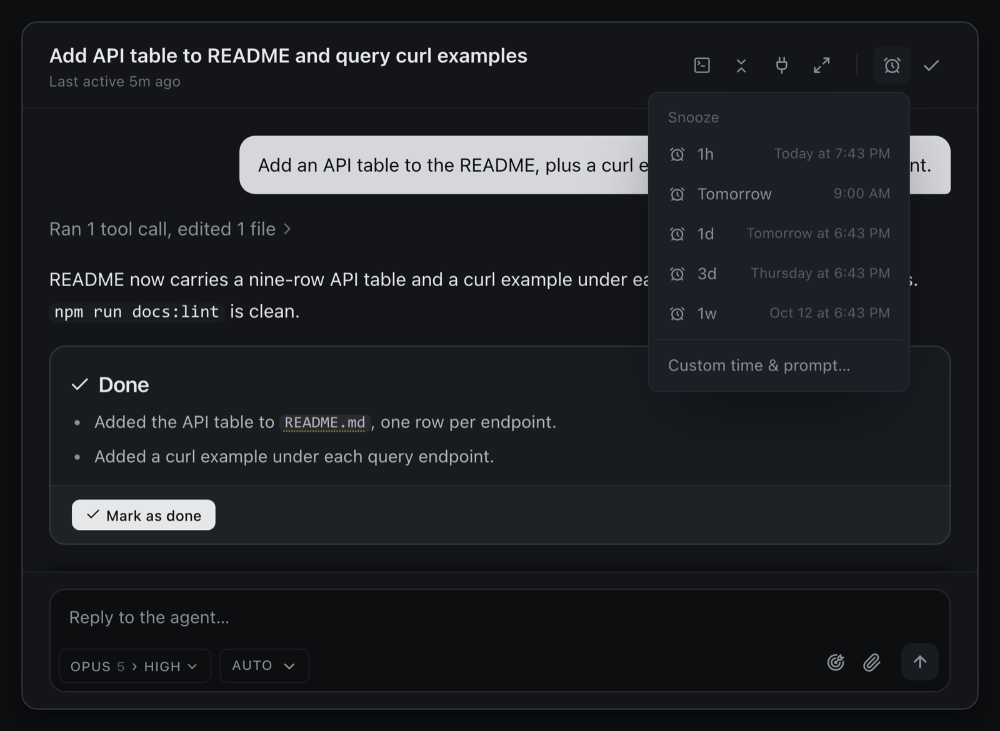
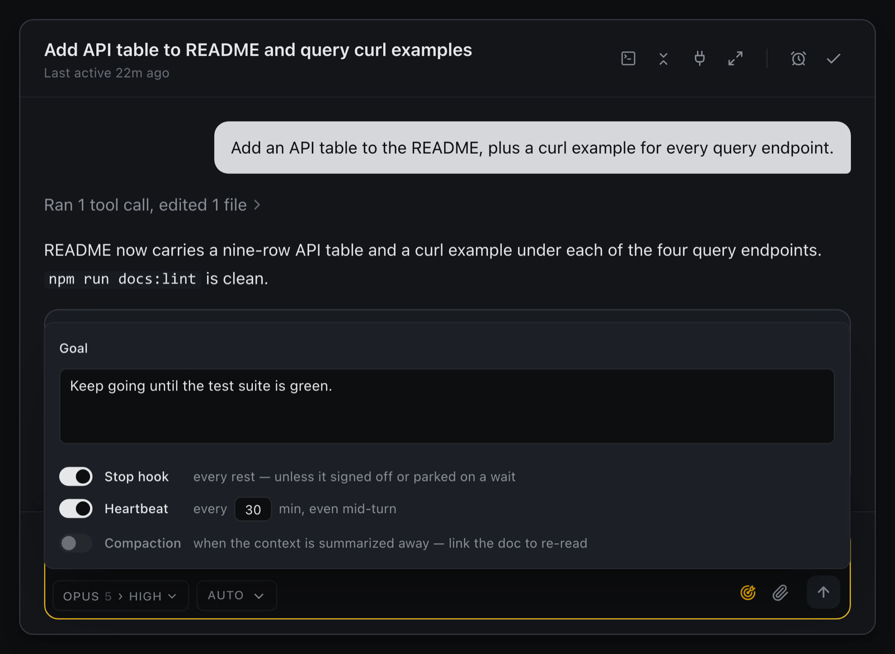

<p align="center">
  <h1 align="center"><br/>Frizz</h1>
  <p align="center">An opinionated agent console for extreme productivity.
    <br/>
    by <a href="https://x.com/colinhacks">@colinhacks</a>
  </p>
</p>
<br/>

<p align="center">
<a href="https://opensource.org/licenses/MIT" rel="nofollow"></a>
<a href="https://www.npmjs.com/package/frizz" rel="nofollow"></a>
<a href="https://github.com/colinhacks/frizz" rel="nofollow"></a>
</p>

<br/>

Frizz is for you if you have any of these opinions:

- Terminal UIs are dated and have fundamental limitations that are incompatible with good user experience.
- Orchestrator-style apps like Conductor feel overly complex.
- It's annoying to constantly switch between sessions to check in on my agents' progress.

<br/>

<h2 align="center">Getting started</h2>

**Requirements.** Node 22.13+, and a [Claude Code](https://claude.com/claude-code) or [Codex](https://developers.openai.com/codex) subscription you are signed in to — Frizz drives the subscription you already pay for. Frizz brings its own pinned copy of each CLI (downloaded once, on first start), so the version on your PATH is yours to manage and never changes what a thread runs.

Then run it in any directory — a repo, a jj checkout, or a folder of scripts. Frizz has no opinion about version control and does not require Git.

```sh
$ cd path/to/acme
$ npx frizz

  FRIZZ v0.4.0  ready in 4.0s

  ➜  Local:    http://127.0.0.1:9393/?focus=acme
  ➜  Project:  acme — path/to/acme
  ➜  Logs:     ~/Library/Application Support/Frizz/projects/979dae3c-fe15-4038-817e-11d0e7491959/logs/frizz-2026-08-01T13-44-43-16931.log

  press ctrl-c to stop · run with --debug for the full event feed
```

A browser tab opens at `http://127.0.0.1:9393/`, with its prompt box aimed at `acme`. Frizz always listens on port 9393 (19393 if something else holds it), and one server serves every project on the machine on one page. Each directory you run it in becomes a **project** on that page, so running `npx frizz` in a second repo registers that project and adds it to the server already running rather than starting another. Runs on macOS, Linux, and Windows.

Prefer a window of its own to a browser tab? The desktop app is on [GitHub releases](https://github.com/colinhacks/frizz/releases?q=desktop) for all three — unsigned builds, so the first launch asks once. It needs the same Node, and starts or joins the same server.

<p align="center">
  
</p>

<br/>

<h2 align="center">Features</h2>

Frizz is a browser tab, a queue, and the agent CLIs you already pay for. It brings no model of its own, automates none of your workflow, and keeps every opinion it does have in a text file you can edit.

- 🗂️ **A task queue, not a sidebar.** Every agent that comes to rest needing you becomes a card. Work the queue top to bottom instead of polling ten terminals.
- 📁 **Projects.** Every directory you run it in becomes a project, all on one server and one page: every project down the left with its threads, and every card waiting on you beside them.
- 🔌 **Headless.** Every thread's agent runs in its own detached background process. Close the tab, quit the browser, ctrl-c the server, reboot — your threads are all still there when you come back, and Frizz reconnects to the ones still running rather than replaying them from disk.
- 🤖 **Claude Code *and* Codex.** Pick the backend per thread and run both against the same repo at once. Frizz supports Claude Code and Codex subscriptions — your sign-in, your settings, your skills, driven by a copy of each CLI that Frizz pins and provisions itself.
- 😴 **Snooze.** Not everything needs an answer now. Park a card for an hour, until tomorrow morning, or until a date you pick — optionally with a follow-up prompt attached, so the thread wakes up already working on what you told it to do next.
- 🎯 **Goals.** Give a thread a standing goal that Frizz re-sends as a prompt — every time it comes to rest, on a clock you set in minutes, or both. Good for "keep going until CI is green" without you re-asking. A scheduled one reaches the agent even mid-turn, so it can nudge a thread that never stops. Switch it off whenever, or let the agent say it's finished.
- 🐙 **GitHub integration.** Browse your repo's issues and pull requests without leaving the composer, and turn a selection of them into threads. Workers can read issues, diffs, and CI on their own.
- 👀 **Built-in CI and PR watchers.** A worker waiting on a build or a review doesn't hand the thread back to you to be told "keep going." It watches, and picks the work back up when the run goes green or a review lands.
- 📝 **No magic.** A thread behaves like a Claude Code session you started yourself. Frizz adds no worktrees, no branches, no dev server, no build integration, no workflow engine to fight with.
- 🔒 **Local only.** No cloud, no account, no telemetry. The server binds `127.0.0.1` by default and its state lives in your user directory, never in your checkout. To reach it from a phone, press R in its terminal — see [Remote access](docs/remote-access.md).

### Projects

Every directory you run `npx frizz` in becomes a project, all served by the one Frizz on your machine. Frizz is one page, at `http://127.0.0.1:9393/`: your projects down the left with the threads in flight under each, and every card waiting on you beside them. There is no separate page per project. A project's snoozed and done threads show as small counts on its row; click the row to list them in place. To work through one project's cards, filter the queue with the **All projects** pill above it, or with **Filter the queue to this project** in the project's ⋯ menu. The filter changes only which cards the queue shows, and the ✕ on the pill clears it. A thread opens in a drawer beside the page, and its ⋯ menu can take it fullscreen.

<p align="center">
  
</p>

The project rail shows every project's icon down the edge of the window, with each queue's count on it; click an icon to filter the queue to that project, and again to clear the filter. It is off by default; switch it on under **Settings → Project sidebar**.

Work that belongs to no project yet — cloning a repository, a question about your machine — starts in **Home**, the last choice in the prompt box's project picker. Its agents run in your home folder, or in the folder you set under **Settings → Home folder**, and its threads are listed under Home in the project list like any project's.

### The queue

A sidebar of sessions makes every agent something you have to remember to go check. Frizz gives you one queue instead.

When an agent comes to rest needing you, a card is added to it. You can quickly evaluate what it has done since your last message and decide to answer its questions, steer it, snooze the card, or mark the session complete. You're continuously presented with a set of action items in one place, instead of constantly switching back and forth between sessions.

The queue is strict about what earns a card, which is what keeps it a real todo list. A thread resting only because *its own* helpers are still working isn't waiting on you, so it stays quiet until they're back. Nothing shows up just to be dismissed.

**Threads are built to run without you.** A worker keeps going until it reaches something only you can settle — a product call, a fork where guessing wrong is expensive to undo, an irreversible action — and then it hands back an answerable *question* rather than a wall of text for you to re-read and interpret.

<p align="center">
  
</p>

Options are lettered and answered in one click, and a worker marks its own recommendation when it has one — so the common case is a single keystroke. There is always a row for writing something else instead.

When the answer isn't one thing, the same card takes several: check any combination and add a note.

<p align="center">
  
</p>

### GitHub

Browse the repo's issues and pull requests from the composer, select any number of them, and each becomes its own thread.

<p align="center">
  
</p>

Workers can also read issues, diffs, and CI on their own — but only read. A worker never comments, labels, closes, or merges unless you ask it to.

### Snooze

Park a card for an hour, until tomorrow morning, or until a date you pick. Attach a follow-up prompt and the thread wakes up already working on it.

<p align="center">
  
</p>

### Goal

Give a thread a standing goal. Frizz sends it as a prompt every time the agent comes to rest, on a clock you set in minutes, or both — a scheduled send reaches the agent even mid-turn, without cutting off work in progress.

<p align="center">
  
</p>

<br/>

<h2 align="center">CLI</h2>

```sh
$ npx frizz --help

Frizz production launcher

Usage: npx frizz [options]

Run it in the directory you want to work in. One server serves EVERY project on this machine,
all on one page, so a second run joins the one already going. Runs the
npm-resolved immutable Frizz package, then opens it in your default browser. Use frizz-dev only
for a source checkout.

Options:
  --no-app               print the URL without opening a browser
  --port <port>          request a fixed port for a new workspace server
  --sandbox              a disposable Frizz to try things in: throwaway home and project, its
                         own port, deleted when this terminal closes; credentials (gh,
                         cloudflared, Claude, Codex, the machine's frizz.sh key) are shared
  --link                 print a fresh single-use access link for the running board
  --debug                stream the full event feed to the terminal instead of the compact readout
  -h, --help             show this help


To reach the board from a phone or another machine, press R in the terminal running it: a short
walkthrough sets up a private frizz.sh name (no account needed), a custom one, a Cloudflare
Tunnel, Tailscale, or a proxy of your own, and
remembers the choice, so a plain launch serves it from then on. The board stays on loopback and
shows a single-use sign-in link as a QR; press L for a fresh one, or run --link from another shell.
```

<br/>

<h2 align="center">FAQ</h2>

<details>
<summary><b>Does Frizz run its own agent or model?</b></summary>

> No. It drives Claude Code or Codex under the account you are signed in to on your machine. Your subscription, your rate limits, your settings. Frizz runs its own pinned copy of each CLI — the exact build it was tested against — rather than whichever version happens to be on your PATH; set `FRIZZ_CLAUDE_BIN` or `FRIZZ_CODEX_BIN` to point it at another one.

</details>

<details>
<summary><b>Does anything leave my machine?</b></summary>

> Nothing from Frizz. There's no account, no telemetry, and the server binds to `127.0.0.1`; reaching it from another device is something you switch on yourself (press R in its terminal). The agents themselves talk to their providers, and `gh` talks to GitHub, but Frizz is a local process looking at local files.

</details>

<details>
<summary><b>What happens if I close the tab?</b></summary>

> Nothing. Each thread's agent runs in its own detached background process, independent of the browser *and* of Frizz itself — you can stop Frizz entirely and your agents keep working. Relaunch, and it reconnects to the sessions that are still running.

</details>

<details>
<summary><b>Does it put junk in my repo?</b></summary>

> Barely. Dispatching a thread writes no thread file into your repo — the agent session *is* the thread. All Frizz adds to your working tree is a `.frizz/` directory holding a scratch directory per thread (empty unless the agent writes something in it) plus a couple of tiny hook state files. Everything durable lives outside your checkout, under `~/.frizz/` if you already have one and otherwise in your platform's own data directory (`~/Library/Application Support/Frizz` on macOS, `$XDG_DATA_HOME/frizz` on Linux, LocalAppData on Windows), so you can delete `.frizz/` and keep every thread and setting. Frizz does not touch your `.gitignore`, so add `.frizz/` yourself if you don't want it in `git status`.

</details>

<details>
<summary><b>Do I have to use worktrees?</b></summary>

> No. Frizz doesn't own your git workflow and won't create branches or worktrees behind your back. Tell your agents what you want in `FRIZZ.md`. If you do run Frizz inside a linked worktree, it isolates that worktree's state from its siblings automatically.

</details>

<details>
<summary><b>Can I run it on several repos at once?</b></summary>

> Yes. One Frizz server serves every project on your machine — you don't start one per repo. Run `npx frizz` in any of them and they all appear on the one page, each with its own threads under its name; each project's threads, settings and state stay separate.

</details>

<details>
<summary><b>Can I reach it from another machine?</b></summary>

> Yes. Press **R** in the terminal running Frizz. A short walkthrough sets up one of four ways to reach Frizz — a name on frizz.sh, a Cloudflare Tunnel you own, Tailscale, or any proxy you run — checks what each needs, prints the commands, and remembers your choice. From then on a plain `npx frizz` serves it; pick **Off** in the same place to go back to loopback only.
>
> To try any of this without touching the Frizz you run, launch a second one with `npx frizz --sandbox` — a throwaway home and project on its own port, deleted on ctrl-c.
>
> Frizz stays bound to `127.0.0.1` in every case. Something in front of it — the frizz.sh relay, the tunnel, Tailscale, your proxy — carries the traffic, and Frizz gates the first visit with a single-use sign-in link shown as a QR. Press **L** for a fresh link any time, or `npx frizz --link` from another shell (over SSH, for a headless box). See [Remote access](docs/remote-access.md) for what each option needs.

</details>

<details>
<summary><b>Can I reach it from anywhere, not just my LAN?</b></summary>

> Same answer: press **R** and pick a private frizz.sh name (unguessable, no account), a custom frizz.sh name, a Cloudflare Tunnel, or Tailscale. Each is reachable from anywhere the transport is — a frizz.sh name and a Cloudflare Tunnel from the open internet, Tailscale from your own devices.
>
> Frizz has no accounts, so the single-use sign-in link **is** the door: a phone that scans it gets a session; nobody else gets in. Sessions are per device and can be listed and revoked with `npx frizz --sessions` and `npx frizz --sign-out`.

</details>

<details>
<summary><b>What platforms does it run on?</b></summary>

> macOS, Linux, and Windows. Windows support landed once the last dependency that had no native Windows build was removed.

</details>

<details>
<summary><b>How is this different from the other orchestrator apps?</b></summary>

> Those apps wrap your agents in their own workflow. Frizz doesn't: it's a viewer and a queue over the CLIs you already run, with every piece of orchestration judgment sitting in editable text instead of inside the binary.

</details>

<br/>

<h2 align="center">Glossary</h2>

Frizz has its own small vocabulary. Most of it names a feature, so this doubles as an index of the opinionated parts.

| Term | What it means |
| --- | --- |
| **Project** | A directory you ran Frizz in. One server holds all of them, and one page shows them all; a thread's address names its project, `/all/<name>/thread/<thread>`. |
| **Thread** | One effort, start to finish. Not a chat tab and not a branch. The session *is* the thread — there's no sidecar document to keep in sync, and dispatching doesn't write a file into your repo. |
| **Worker** | The agent driving a thread: a real Claude Code or Codex process, running as *you*, with your credentials and your CLI config. |
| **Sub-agent** | A helper a worker dispatches for an independent prong of its own task. Frizz binds each one back to its parent, so the fan-out is visible under the parent's card. |
| **Rested** | An agent that has ended its turn and is waiting on a human. A rested thread isn't idle, it's *your move*. |
| **The queue** | The single list of threads that need you. A thread only earns a card when it genuinely wants a human. |
| **Snooze** | Hide a card until later — an hour, tomorrow morning, or a date you pick — optionally with a follow-up prompt attached. |
| **Goal** | A standing prompt a thread receives on its own — every time it rests, on a clock, or both — until you switch it off or the agent says it's done. |
| **Scratchpad** | A thread's durable working memory, readable under its **Doc** tab. Where a worker keeps what a summary would otherwise lose: the approach, the alternatives it rejected, the decisions you made and reversed. |
| **`FRIZZ.md`** | An optional file at your repo root whose contents are injected into every thread, for when you want agents to follow your repo's own norms. |

<br/>

<h2 align="center">Docs</h2>

- [`ARCHITECTURE.md`](ARCHITECTURE.md) — the invariants, layout, and design decisions. Read it before changing anything.
- [`FRIZZ.md`](FRIZZ.md) — this repo's own worker norms, as a worked example of the optional per-repo prompt.

<br/>

<h2 align="center">Contributing</h2>

Issues and pull requests are welcome. Fork the repo, branch off `main`, and open the PR against `main` — CI runs on every pull request.

Three checks run in CI, and they need no install:

```sh
$ node --test board/*.test.mjs
$ node scripts/sync-portable-monitors.mjs --check
$ node --test monitors/*.test.mjs
```

Everything else runs locally. Install with `pnpm install`, typecheck with `pnpm typecheck`, and run the full suite with `pnpm test` — that suite drives real agent CLIs and a real browser, which is why CI does not gate on it. Say in the PR what you ran. The suite needs a newer Node than the runtime does: early 22.x point releases (22.15 measured) fail `receipt-bus.test.ts` on a since-fixed test-runner defect, so run it on current 22.x or ≥ 23.4.

<br/>

<h2 align="center">License</h2>

MIT
